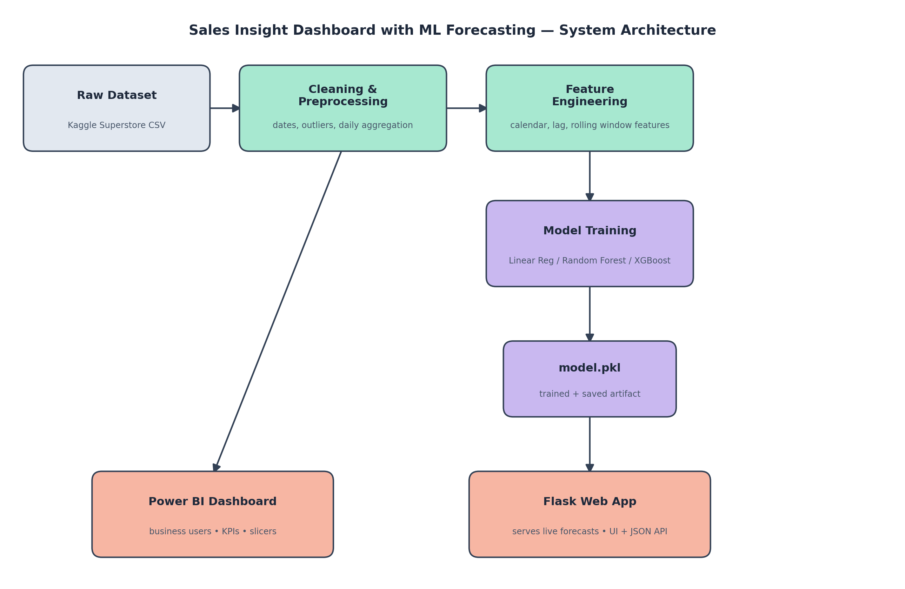

# Sales Insight Dashboard with ML Forecasting

An end-to-end data science project that cleans and analyzes retail sales data, forecasts future sales using a tuned XGBoost model, and serves predictions through both an interactive Power BI dashboard and a deployed Flask web application.

**Live Demo:** [https://sales-insight-dashboard.onrender.com](#) _(replace with your actual Render URL)_

---

## Project Overview

This project answers three questions a retail business regularly asks:
1. **What happened?** — historical sales trends, regional and category performance (Power BI)
2. **Why did it happen?** — feature importance analysis showing what actually drives sales (ML model)
3. **What's next?** — a 1-90 day sales forecast, served via a web app (Flask + XGBoost)

## Architecture

Raw sales data flows through a Python cleaning/preprocessing pipeline into two parallel consumers: a Power BI dashboard for descriptive analytics, and a trained ML model served through Flask for predictive analytics.

## Dataset

- **Source:** Kaggle Superstore Sales Dataset
- **Size:** 9,800 order-level rows, 2015–2018
- **Note:** This dataset variant does not include profit, discount, or quantity columns — analysis and forecasting are scoped to `sales` as the target metric.
- Raw data is not included in this repository (see `.gitignore`); download instructions are below.

## Tech Stack

| Layer | Tools |
|---|---|
| Data Cleaning & Preprocessing | Python, pandas, numpy |
| EDA & Visualization | matplotlib, seaborn |
| Machine Learning | scikit-learn, XGBoost |
| Business Intelligence | Power BI (DAX, Power Query) |
| Web Application | Flask, Waitress |
| Deployment | Render |

## Project Structure